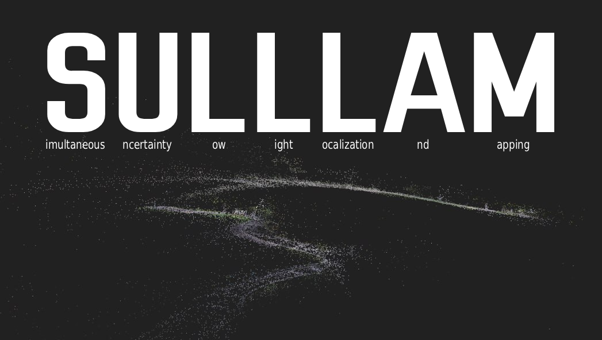

<div align="center">
  
</div>


## Installation

> [!IMPORTANT]
> Keep in mind, that CUDA GPU is required for using the project.

1. Clone with submodules

    ```bash
    git clone --recurse-submodules https://github.com/n1n1n1q/SULLLAM.git
    cd SULLLAM
    ```

    If already cloned without submodules:

    ```bash
    git submodule update --init --recursive
    ```

2. Create the Conda environment

    ```bash
    conda env create -f environment.yml
    conda activate sulllam
    ```

    Install Theseus (submodule)

    ```bash
    pip install -e submodules/theseus
    ```

3. Download SAM2 checkpoint

    ```bash
    mkdir -p checkpoints
    ```

    SAM2 model config is included via the SAM2 submodule.

---

## Usage

### Run the SLAM pipeline

```bash
python scripts/run_pipeline.py /path/to/images/
```

**Arguments:**

| Argument | Default | Description |
|---|---|---|
| `image_dir` | *(required)* | Directory of `.png` frames |
| `--step` | `15` | Load every Nth image |
| `--clouds-dir` | `clouds/` | Output directory for point clouds |
| `--sam-checkpoint` | `checkpoints/sam2_hiera_tiny.pt` | SAM2 model weights |
| `--sam-cfg` | `sam2_hiera_t.yaml` | SAM2 model config |
| `--device` | `cuda` | Device (`cuda` or `cpu`) |

> [!NOTE]
> Camera intrinsics are currently hardcoded in `scripts/run_pipeline.py` as the parameters of the iPhone14 camera. Edit the `K` matrix at the top of the file to match your camera:
> ```python
> K = np.array([
>     [fx,  0, cx],
>     [ 0, fy, cy],
>     [ 0,  0,  1]
> ])
> ```

### Evaluation

For evaluation, use GT in the COLMAP-compatible format.

```bash
python scripts/evaluate_trajectory.py \
  --images /path/to/images \
  --colmap-dir /path/to/colmap/sparse/0 \
  --fx 1013.5 --fy 1060.7 \
  --cx 638.3  --cy 399.3
```

Outputs (in `eval_output/`):
- `trajectory_slam.npy` - raw SLAM trajectory
- `trajectory_slam_aligned.npy` - Sim(3)-aligned trajectory
- `ate_per_frame.npy` - per-frame ATE errors
- `trajectory_eval.png` - trajectory comparison plot

---

## Configuration

`SLAMConfig` controls pipeline behavior:

| Parameter | Default | Description |
|---|---|---|
| `K` | — | 3×3 camera intrinsics matrix |
| `max_reproj_error` | `2.0` px | Reprojection error threshold |
| `max_depth` | `50.0` m | Max depth for triangulated points |
| `max_points` | `100–200` | Max tracked points per frame |
| `ba_frequency` | `5` | Run bundle adjustment every N frames |
| `ba_min_frames` | `12–15` | Minimum frames before first BA |
| `kf_min_translation` | `0.1` m | Keyframe translation threshold |
| `kf_min_rotation_deg` | `5.0` deg | Keyframe rotation threshold |
| `lc_frequency` | `10` | Loop closure check frequency |

---

## ROS 2 Integration

With ROS 2 Humble active, the pipeline publishes in real time:
- Camera trajectory
- 3D point cloud
- TF transforms

The `ROSPublisherWrapper` in `sulllam/utils/ros.py` handles publishing and shuts down cleanly when the pipeline finishes. Pass `ros_publisher=None` to disable.

---

## License

GNU General Public License v3.0 -- see [LICENSE](LICENSE).
